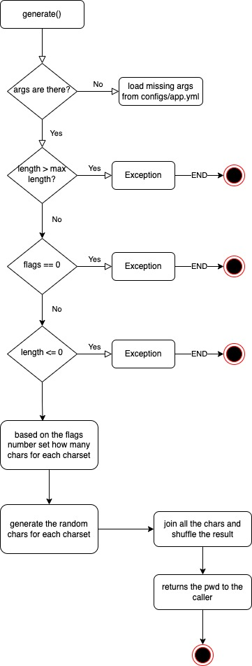

# Python Fast API Password generation

The repo contains a FastAPI Web application able to generate a random password. The format of the generated password
can be decided by the user passing to the web method specific argument (query params).

## Application requirements
The service should follow these requirements:
- Password length (if length is for example 10 it should generate and return random password with length of 10)
- Numbers flag (if enabled it should consider number symbols during password generation, like ‘1’, ‘2’, …, ‘9’)
- Lowercase chars flag (if enabled it should consider lowercase ascii characters also during password generation, like ‘a’, ‘b’, … , ‘z’)
- Uppercase chars flag (if enabled it should consider uppercase ascii characters also during password generation, like ‘A’, ‘B’, … , ‘Z’)
- Special symbols flag (if enabled it should consider special symbols also during password generation, like ‘%’, ‘$’, … , ‘@’)
- Password length is limited to 200 characters max
- It should raise an exception and return formatted response correspondingly in case if user makes request with disabling all features

Default password length and default flags should be configurable from the server.

### Functional Considerations

- based on the flags numbers present the application will generate the password with the corresponding bunch of chars using this algo: len/numbers of flags determines how many chars of a specific set has to be considered. For example:

```shell
numbers_flag = true
lowercase_chars = true
pwd length = 10
10 / 2 = 5
```

the application will create a pwd with 5 numbers and 5 lower chars. If a generated pwd is still < to the length, the application will add other chars
from the valid sets. In case the division gives 0, it means that the length is not enough to satisfy all the char sets: in this case will be assigned
each enabled charset until the length is satisfied, for example:

```shell
length = 2
flags = 3
2 // 3 = 0, remainder 2
in this case the distribution is 0, therefore the charset will be set to 1 having 1 char for each set
```

#### Edge cases

These are some of the edge cases:

- the characters set length contains less characters that the requested pwd length: the char set is doubled, tripled etc... until the final length is reached. For example:

```shell
pwd length = 100
only special chars = true
the given pwd will 100 special chars
```

- length is < 0 or > 200: error is given
- all flags are false: error is given
- the charsets are greater than the pwd length (see the previous paragraph)

### Technical considerations

The application will use the following Python libraries:

- `pytest`: in order to make the unit test
- `fastapi`: for the deployment of the Web API service
- the application has a Makefile in order to execute test, start the application etc...
- the unit test are executed only for the engine, not for the wep app. This choice is necessary considering the timing constraints.
- the error thrown by the API Server is compliant with the Google JSON standard guide and has the following format:

```json
{
  "apiVersion": "2.0",
  "error": {
    "code": 404,
    "message": "File Not Found",
    "errors": [{
      "domain": "Calendar",
      "reason": "ResourceNotFoundException",
      "message": "File Not Found
    }]
  }
}
```

for the sake of the example the JSON errors list is omitted.

- the default values for the API query params are taken from the configs/app.yml file (in case they are not passed to the API)

Locally the libraries will be installed into a virtual environment and each dependencies will be listed in a `requirements.txt` file.
To reproduce locally you have to follow these steps:
```shell
python3 -m venv .venv --prompt='swisscom-pwdgen'
source .venv/bin/activate
pip3 install -r requirements.txt
```

The application has been developed using Python 3.11.0, a version lower than 3.10 will throw an error in the FastAPI query params validation. The application has not be tested in a multiple env (using `tox` for example) for a matter of timing.

- the application resources are not separated by the main module. A better organisation would be needed if the application is going to increase.

- the application prints some debug information onto the standard output. Can be improved having a log where the verbosity can be set using a specific ENV variable.

- the documentation for calling the API can be directly consulted from [here](http://localhost:8080/docs)

### Folder structure

The service has the following folder structure:

- `src`: it is the folder that contains the application code
- `configs`: it is the folder that contains the configuration files. The config module will expose these values for the entire project.
The `app.yml` file is the config file for the application and contains all the default rule for the password generation. In case no params
are given the server will use the default ones.

### Run the application

There are several ways to run this application:

- you can download the code from github and run the application locally (Python > 3.10 is requested, make is needed):

```shell
git clone ...
cd ...
python3 -m venv .venv --prompt='pwdgen-api-env'
source .venv/bin/activate
pip3 install -r requirements.txt
make run_local
curl -X POST -s 'http://localhost:8080/passwords?numbers=0&special=0&uppercase=0&lowercase=0&length=10'
```

- if you do not have `make` installed on your environment you can run as:

```shell
cd src; uvicorn main:app --host "0.0.0.0" --port 8080 --reload
```

- after the git clone, you can also run the application using Docker (Docker has to be previously installed):

```shell
docker-compose -f docker-compose.dev.yml up --build
curl -X POST -s 'http://localhost:8080/passwords?numbers=0&special=0&uppercase=0&lowercase=0&length=10'
```

- you can also refer to the Docker Hub and run the application directly as:

```shell
docker run --rm -it --name pwdgen-api --publish 8080:8080 mas2020/pwdgen-api:latest
```

### Application flow

Follows a schema that represents the flow for the pwd generation:

